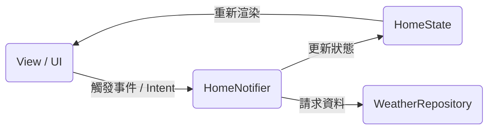

# 台灣天氣預報 (Weather Forecast)

一個基於 Flutter 開發的台灣今明 36 小時天氣預報應用程式。本專案以台灣中央氣象署 (CWA) 的 Open Data API 作為資料來源，並採用了現代化的行動端開發架構與極致的用戶體驗設計。

---

## 🛠️ 技術棧與套件選型

*   **核心框架**：`Flutter` 與 `Dart`
*   **狀態管理**：`Riverpod` (提供單向資料流及高度可測試的狀態共享)
*   **網路請求**：`Dio` (靈活的 HTTP 用戶端，支援攔截器與請求/響應自訂)
*   **本地儲存**：`SharedPreferences` (用以持久化 API 授權碼)
*   **UI/UX 增強**：
    *   `pull_to_refresh` (下拉刷新天氣)
    *   自定義微動畫 (如卡片載入與動態氣象漸變)
    *   符合 Flutter 3.22+ 規範的 `withValues` 顏色不透明度處理

---

## 🏛️ 架構設計：MVI (Model-View-Intent) 模式

本專案採用 **MVI (Model-View-Intent)** 架構來組織代碼，搭配 Riverpod 的狀態管理以實現高度解耦與單向資料流 (Unidirectional Data Flow)：



### 1. Model (State) — `HomeState`
定義了首頁畫面的單一資料源。所有 UI 元素僅對應此狀態：
*   `weatherData`：解析後的天氣資料物件 (來自中央氣象署)。
*   `isLoading`：指示當前是否正在載入資料。
*   `error`：若請求失敗，存放詳細的錯誤訊息。
*   `showApiKeyPanel`：用以控制 API 金鑰輸入面板的開合。

### 2. View (UI) — `HomePage`
UI 層完全為**無狀態**或僅響應 State。畫面的主體視圖由 `HomeState` 驅動，分流出四種狀態視圖：
*   **`WeatherInitialView`**：初始狀態，提供台灣 22 個縣市的快速選擇網格。
*   **`WeatherDataView`**：成功獲取資料後，顯示精心設計的天氣大卡片以及 36 小時時段預報時間軸。
*   **`WeatherErrorView`**：在 API 異常、地名搜尋無效或授權碼錯誤時顯示，並提供回首頁的引導按鈕。
*   **`ApiKeyPanel`**：獨立抽離的授權碼輸入面板，在 UI 操作時以平滑動畫 (`AnimatedCrossFade`) 呈現。

### 3. Intent (Notifier) — `HomeNotifier`
承接使用者的意圖 (如：搜尋地區、更新 API 金鑰、重置頁面)，呼叫 Repository 後將處理結果發佈為新的 `HomeState`。

---

## 🔌 API 設計與網路模組 (Dio)

底層使用封裝好的 `ApiManager` 與 `ApiService` 進行氣象資料傳輸，具備高強健性：

```
[ApiManager] ──(Dio 實例)──> [AuthInterceptor] ──> [ApiLogInterceptor] ──> [CWA API]
```

### 1. 攔截器 (Interceptor) 鏈
*   **`AuthInterceptor` (授權攔截器)**：
    *   專門處理 CWA 的 API Key。
    *   發送請求前，會自動從 `SharedPref` (本地磁碟) 中同步讀取金鑰，並將其注入到 Http Header 的 `Authorization` 中。
    *   解決了「每次請求都需要手動帶金鑰參數」以及「動態變更金鑰後無法即時套用」的痛點。
*   **`ApiLogInterceptor` (日誌攔截器)**：
    *   格式化輸出所有 Outgoing Requests 與 Incoming Responses 的 Headers、Body 和 Query Parameters，便於開發期 Debug。

### 2. 初始化流程
為了防止每次讀值時都要進行 `await` 造成的異步延遲，我們採取了一次性載入的設計：
1. 在 `main.dart` 啟動時，預先執行一次 `await SharedPref().init()` 以完成實例的異步加載。
2. 後續在 `AuthInterceptor` 或其他地方讀取 API Key 等設定時，便能直接呼叫同步的 `getValue`，即時且高效地取得本地儲存的值，完全避免了每次讀取都需要 `await` 的效能損耗。

---

## 🎨 功能特色與體驗細節

### 1. 動態天氣卡片與漸變色
在 `WeatherDataView` 中，大卡片的背景色與陰影會根據中央氣象署回傳的 **Wx (天氣狀態代碼)** 動態改變：
*   **晴天**：呈現明亮的橘紅色漸變與陰影。
*   **晴時多雲**：採用品牌代表色 (6FBDB6) 與天空藍的舒適漸變。
*   **陰天/多雲**：呈現沉穩的藍灰色調。
*   **雨天/雷雨**：呈現深邃的雨林深藍色調。

### 2. 即時搜尋與重設機制
*   搜尋框配置了監聽器，一旦清空搜尋框文字，畫面會瞬間重設 (`notifier.reset()`) 回 `InitialView`，無需手動點選重設。
*   當輸入「台北市」時，Repository 在發送請求前會將其標準化（例如統一轉換為「臺北市」），符合中央氣象署的查詢規範。

### 3. 下拉刷新 (Pull-to-Refresh)
*   首頁天氣資訊接入了 `SmartRefresher`。
*   下拉時會自動觸發 `onRefresh()` 回呼，向伺服器拉取最新的天氣動態並完成狀態的即時更新。

### 4. 模組化元件抽離
為避免過深的嵌套樹 (Widget Tree)，主要版面已被重構並拆分為獨立的私有輔助方法：
*   `_buildMainWeatherCard` (天氣資訊大卡片)
*   `_buildForecastPeriodItem` (時段天氣預報時間軸項目)
